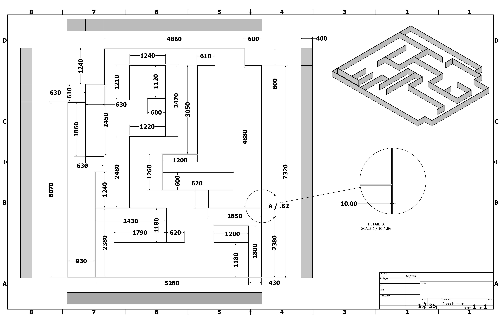
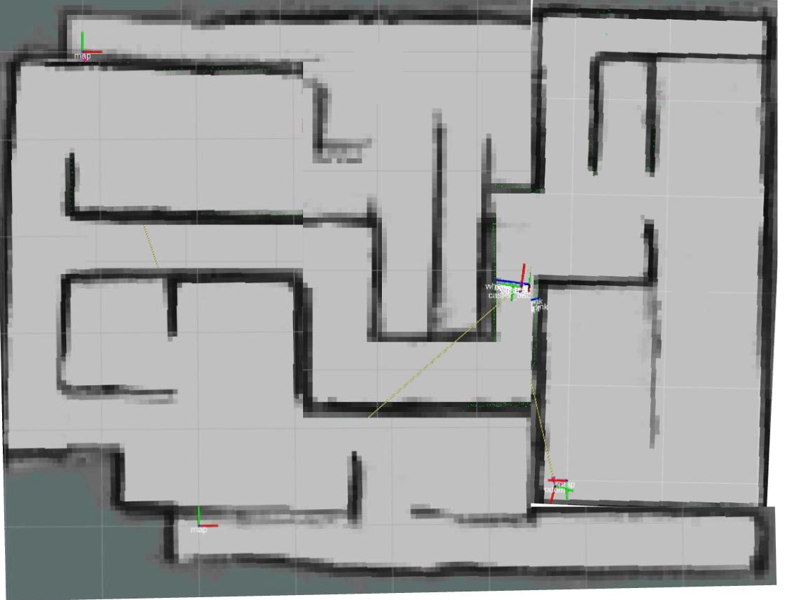
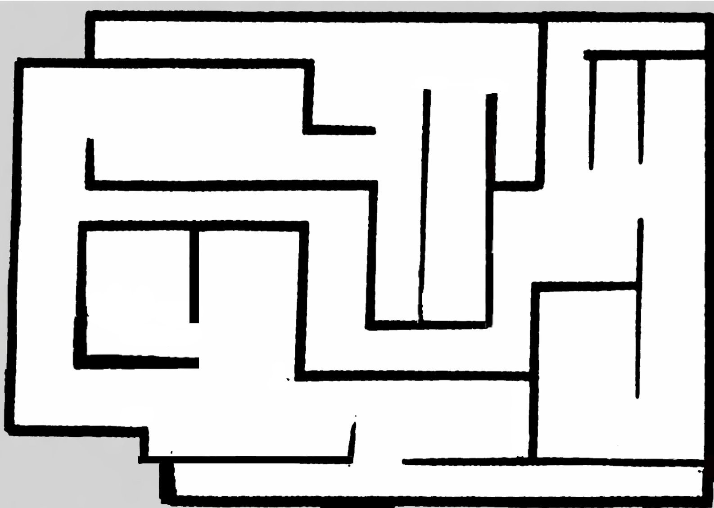
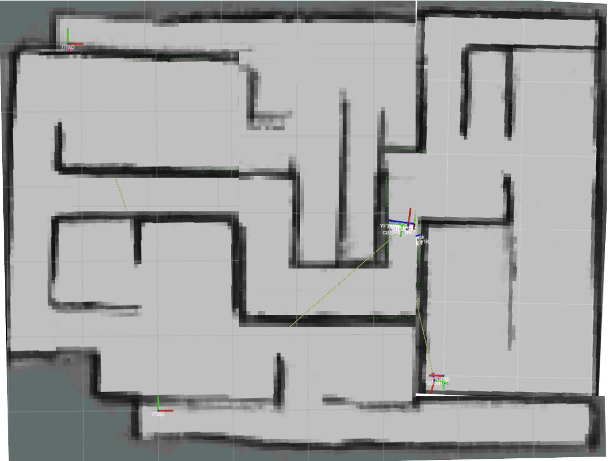
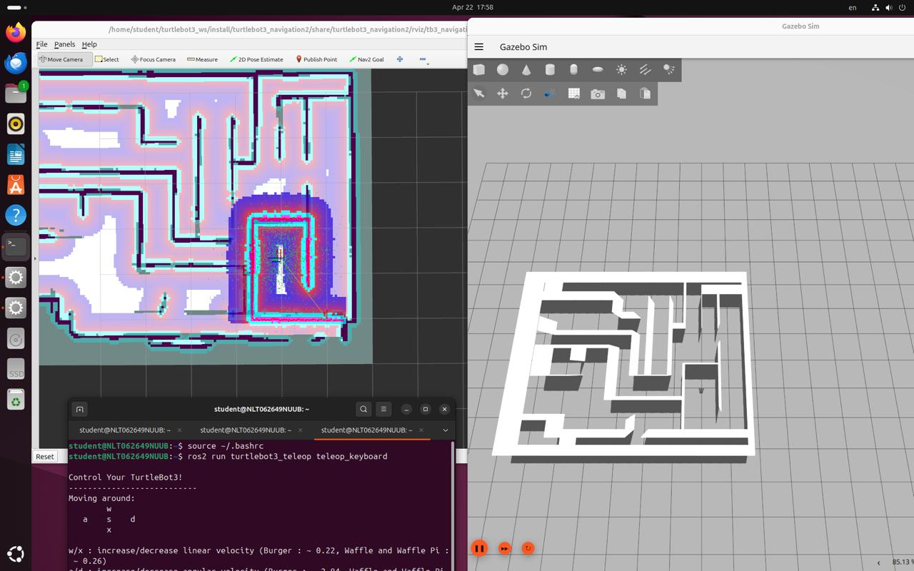
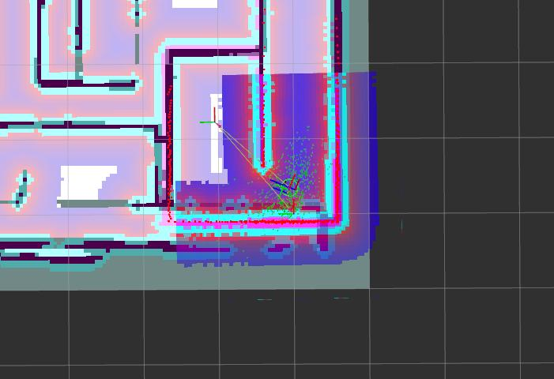

# TurtleBot3 SLAM & Autonomous Navigation

End-to-end mobile-robot pipeline on the TurtleBot3 Burger platform: build a 2D occupancy map of an unknown labyrinth with SLAM, then use that map to autonomously navigate the same labyrinth with the ROS 2 Nav2 stack. The work spans a real physical maze, a custom Gazebo simulation of the same maze, and a systematic parameter-tuning study of Nav2's costmaps, planners, and controllers.

**Stack:** ROS 2 Humble · Gazebo Classic · slam_toolbox / gmapping · Nav2 (AMCL, NavFn, DWB) · TurtleBot3 Burger · Python · LiDAR (LDS-01) · RViz2

---

## Demos

<!-- ============================================================
     TODO: replace each placeholder with the matching GIF when ready.

     File names expected:
       docs/demo_real_slam.gif       (Phase 1 — real robot building map)
       docs/demo_sim_slam.gif        (Phase 2 — Gazebo SLAM)
       docs/demo_nav2_autonomous.gif (Phase 3 — Nav2 autonomous run)

     Recommended: 10-15s loop, 480p width, 15 fps, < 5MB each.
     Convert MP4 -> GIF at https://ezgif.com/video-to-gif
     ============================================================ -->

<table>
<tr>
<td width="33%" align="center"><em>Phase 1 — Real-world SLAM mapping<br/>(GIF coming soon)</em></td>
<td width="33%" align="center"><em>Phase 2 — Custom Gazebo + SLAM<br/>(GIF coming soon)</em></td>
<td width="34%" align="center"><em>Phase 3 — Nav2 autonomous navigation<br/>(GIF coming soon)</em></td>
</tr>
</table>

---

## Project arc

The project unfolds in three phases, each building on the previous one:

| Phase | What | Where | Outcome |
|---|---|---|---|
| **1. Real-world SLAM** | Drive TurtleBot3 manually through a physical lab labyrinth; build map with gmapping. | Robotics lab, NU | `maps/labyrinth_real.pgm` |
| **2. Sim SLAM on custom world** | Author a custom labyrinth Gazebo world; repeat SLAM in simulation; compare results. | Gazebo Classic | `maps/labyrinth_sim.pgm` |
| **3. Autonomous Nav2** | Load the saved map, tune costmap and planner parameters, run autonomous goals. | Gazebo + Nav2 | Tuned `config/nav2_params.yaml` |

This arc maps directly to the three labs that produced it:
**Lab 3** (real-world SLAM) → **Lab 4** (sim SLAM) → **Lab 5** (Nav2 + tuning).

---

## Phase 1 — Real-world SLAM

The physical labyrinth was assembled from rigid wall panels at the NU robotics lab. The exact geometry is documented in an engineering drawing with millimeter dimensions; this matters because the same geometry was later modeled as an STL for the Gazebo simulation in Phase 2.

<table>
<tr>
<td width="50%"></td>
<td width="50%"></td>
</tr>
<tr>
<td align="center"><em>Engineering drawing of the physical labyrinth (mm)</em></td>
<td align="center"><em>RViz occupancy grid produced by gmapping on the real TurtleBot3</em></td>
</tr>
</table>

### Setup

- **Robot**: TurtleBot3 Burger (differential drive, LDS-01 360° LiDAR, Raspberry Pi onboard).
- **Network**: SSH from a remote laptop into the Pi over a shared Wi-Fi hotspot.
- **SLAM**: gmapping from the standard TurtleBot3 SLAM package.

### Run

The Lab 3 workflow was the standard three-terminal ROS pattern:

```bash
# Terminal 1 — on the robot, over SSH: start the bringup stack
ssh ubuntu@<robot-ip>
roslaunch turtlebot3_bringup turtlebot3_robot.launch

# Terminal 2 — on the laptop: start SLAM + RViz
export TURTLEBOT3_MODEL=burger
roslaunch turtlebot3_slam turtlebot3_slam.launch

# Terminal 3 — on the laptop: teleop the robot manually through the maze
roslaunch turtlebot3_teleop turtlebot3_teleop_key.launch
```

The robot was driven slowly through the maze while watching RViz fill in the occupancy grid in real time. Once the map covered the full labyrinth:

```bash
rosrun map_server map_saver -f ~/labyrinth_real
```

The resulting map (`labyrinth_real.pgm + .yaml`) is the input to Phase 3 for navigation on the real robot.

### What the real-world map taught us

- **Wall thickness in the map is not the wall's real thickness.** Each wall appears as a ~10 cm-thick band because of LiDAR scan misalignment across multiple passes — every minor odometry drift smears the same wall across slightly offset scans.
- **Phantom obstacles appear in poorly-scanned regions.** Corners that the LiDAR only briefly observed show scattered occupied cells in otherwise free space. These will later cause Nav2 to plan slightly weird routes through those areas.
- **Map origin matters.** The map saver writes an `origin: [x, y, theta]` line in the YAML. If we later edit this by hand the AMCL initial pose will be wrong relative to the map and localization will fail; we treat the saved origin as authoritative.

---

## Phase 2 — Custom Gazebo world + SLAM in simulation

To repeat the experiment with ground-truth-like sensor data, we modeled the same maze in Gazebo Classic. This required three pieces:

1. A **Gazebo model package** (`gazebo/models/labyrinth/`) containing `model.config`, `model.sdf`, and an STL mesh of the walls.
2. A **world file** (`gazebo/worlds/labyrinth.world`) that loads sun, ground plane, physics, the labyrinth model, and a top-down camera.
3. A **launch file** (`launch/labyrinth_world.launch.py`) that opens Gazebo with this world and spawns the TurtleBot3 at a chosen initial pose.

<table>
<tr>
<td width="50%"></td>
<td width="50%"></td>
</tr>
<tr>
<td align="center"><em>Top-down view of the maze used to derive the STL geometry</em></td>
<td align="center"><em>SLAM occupancy grid produced inside Gazebo simulation</em></td>
</tr>
</table>

### Real-world vs. simulation maps

The maze topology is identical between the two runs (same dimensions, same wall layout), but the simulated map's wall edges are visibly cleaner. This is the single most useful demonstration in the project: it makes concrete the difference between *perfect virtual sensing* and *real LiDAR with cumulative odometry error*. Anyone who has only ever done robotics in simulation can underestimate this gap; doing both side by side bakes it in.

### One concrete debugging story (ROS1 → ROS2)

The Lab 4 brief was written for ROS1 / catkin. Our setup ran ROS 2 (Jazzy at the time of Lab 4; consolidated to Humble in this repository for portability). Two issues that took meaningful debugging time:

- `roslaunch` doesn't exist — we replaced it with `ros2 launch` and rewrote the world/spawn launchers as Python `LaunchDescription` files (the `launch/labyrinth_world.launch.py` in this repo is the reconstructed version of those).
- The original brief used `<include><uri>model://...</uri></include>`; our Gazebo discovered the model only after we exported `GAZEBO_MODEL_PATH` to include `gazebo/models/`.

The slam_pipeline_sim.sh script bakes both fixes in.

### Run

```bash
export TURTLEBOT3_MODEL=burger
export GAZEBO_MODEL_PATH=$GAZEBO_MODEL_PATH:<path-to-repo>/gazebo/models

# Or use the convenience launcher (opens 3 terminals):
./scripts/slam_mapping_sim.sh
```

Save the resulting map:

```bash
ros2 run nav2_map_server map_saver_cli -f maps/labyrinth_sim
```

---

## Phase 3 — Autonomous navigation with Nav2

With both maps in hand, the goal in Phase 3 was to make the robot navigate **autonomously**: given a goal in the free space of the map, plan a collision-free path and drive there without human intervention.



*RViz costmap overlay (left), Gazebo 3D simulation (right), teleop terminal (bottom). The cyan/magenta inflation layers, green AMCL particle cluster, and orange planned path are all visible in RViz.*

### What the stack does

| Component | Role |
|---|---|
| `map_server` | Publishes the static map from `maps/labyrinth_sim.yaml`. |
| `amcl` | Adaptive Monte Carlo localization on the static map using LiDAR scans. |
| Global costmap | Static map + inflation layer for long-range planning. |
| Local costmap | Rolling, sensor-fed, voxel + inflation for real-time obstacle avoidance. |
| `nav2_navfn_planner` | Dijkstra global planner. |
| `dwb_core::DWBLocalPlanner` | Dynamic Window Approach local controller. |
| `nav2_behaviors` | Spin, back-up, wait recovery behaviors. |

### Run

```bash
export TURTLEBOT3_MODEL=burger

# Convenience launcher (opens Gazebo + Nav2 in two terminals):
./scripts/autonomous_navigation_sim.sh

# Or manually:
ros2 launch launch/labyrinth_world.launch.py     # terminal 1
ros2 launch launch/navigation.launch.py \
    map:=maps/labyrinth_sim.yaml use_sim_time:=true   # terminal 2
```

Then in RViz:

1. **2D Pose Estimate** — click+drag at the robot's true starting pose. The AMCL particle cloud should collapse around the robot.
2. Optionally drive a few seconds with `teleop_keyboard` so AMCL converges.
3. **Nav2 Goal** — click anywhere on the map; the robot plans and drives.

### What "converged" looks like

The screenshot below shows the AMCL particle cluster (green arrows) tightly grouped around the robot's true position. Compare this to the initial state where the particles are spread across the entire map — the convergence step is visually clear, and it's the moment the robot becomes reliable enough to send goals to.

<p align="center">
  
</p>

---

## Parameter tuning (Lab 5)

The Nav2 default parameters work but are not optimal for this maze. We swept six parameters systematically — changing one at a time, observing the robot's behavior, then converging on a final value. The full tuned config is in `config/nav2_params.yaml` with inline comments explaining each chosen value.

| Parameter | Swept range | Final value | Observation |
|---|---|---|---|
| `inflation_radius` (costmaps) | 0.15 → 0.50 m | **0.30 m** | At 0.15 m the robot planned paths very close to walls and occasionally grazed corners. At 0.50 m the inflated zones consumed most of the corridor width, making narrow passages impossible to plan through. 0.25–0.30 m was the best balance; 0.30 m chosen to keep some safety margin. |
| `max_vel_x` (DWB) | 0.15 → 0.26 m/s | **0.22 m/s** | At 0.26 m/s the robot overshot turns — the local planner could not decelerate quickly enough. The Burger's nominal 0.22 m/s gave clean turns and rarely triggered recovery behaviors. |
| `max_vel_theta` (DWB) | 1.0 → 2.5 rad/s | **1.0 rad/s** | Higher angular velocity made in-place rotations faster but caused oscillation at the start of new goal segments. 1.0 rad/s preferred for stability. |
| `xy_goal_tolerance` | 0.05 → 0.20 m | **0.10 m** | 0.05 m caused very precise final approaches, sometimes spinning in place; 0.20 m declared success up to 20 cm from the goal. 0.10 m is the practical compromise. |
| `yaw_goal_tolerance` | 0.05 → 0.50 rad | **0.20 rad** | Tight values caused extended spinning at the destination; 0.20 rad gives a sensible final orientation without unnecessary rotation. |
| `sim_time` (DWB) | 1.5 → 3.5 s | **2.0 s** | Longer simulation horizon lets the local planner see further ahead and anticipate turns, producing smoother arcs rather than sharp pivots. Anything past 2.5 s started to interact badly with `max_vel_x`. |

The single most important learning: **the parameters are not independent**. Increasing `max_vel_x` without also raising `sim_time` consistently produced unstable behavior because the planner's lookahead became too short for the new speed.

---

## Observations and lessons learned

**Map quality predicts navigation quality.** Areas of the map that the SLAM session covered well showed clean obstacle boundaries; the planner found paths through them confidently. Partially-mapped corners produced scattered "phantom" occupied cells, and the planner sometimes generated awkward detours or failed to plan on the first attempt (triggering a recovery, which usually succeeded after re-planning).

**Initial pose matters more than you'd think.** If the 2D Pose Estimate is significantly wrong, AMCL converges to a *local* optimum — a place on the map whose scan happens to match the current scan closely. Clearing AMCL state and providing a better initial guess fixes this. We learned to always start AMCL from a known landmark in the maze.

**Narrow corridors stress the inflation radius.** The narrowest passages in our maze were only slightly wider than the Burger's footprint plus the inflation radius. At our chosen 0.30 m inflation we sometimes had to drive the robot close to a wall to leave a clear plan; reducing inflation for these specific passages is a real-world option we documented but did not productize.

**The interdependence is what makes Nav2 hard.** A bad localization produces a bad costmap; a bad costmap produces invalid plans; invalid plans trigger recoveries that may also fail if localization is still wrong. Robustness in a mobile robot is about making *each* subsystem fail gracefully and recover, not about making any one of them perfect.

---

## Repository structure

```
turtlebot3-slam-navigation/
├── README.md                          ← this file
├── LICENSE                            ← MIT
├── .gitignore
│
├── gazebo/
│   ├── models/
│   │   └── labyrinth/
│   │       ├── model.config           ← Gazebo model manifest
│   │       ├── model.sdf              ← static body referencing STL mesh
│   │       └── meshes/
│   │           └── README.md          ← how to place your labyrinth.stl here
│   └── worlds/
│       └── labyrinth.world            ← sun, ground, physics, labyrinth, camera
│
├── launch/
│   ├── labyrinth_world.launch.py      ← opens Gazebo + spawns TurtleBot3
│   └── navigation.launch.py           ← Nav2 stack with our tuned params
│
├── config/
│   └── nav2_params.yaml               ← every TUNED parameter has an inline comment
│
├── maps/
│   └── README.md                      ← how to produce labyrinth_{sim,real}.{pgm,yaml}
│
├── scripts/
│   ├── slam_mapping_sim.sh            ← opens 3 terminals: Gazebo, SLAM, teleop
│   └── autonomous_navigation_sim.sh   ← opens 2 terminals: Gazebo, Nav2
│
└── docs/
    ├── 01_robot_ssh_setup.jpg         ← SSH onto the real Pi
    ├── 02_physical_labyrinth_drawing.jpg
    ├── 03_slam_map_real_world.png
    ├── 04_labyrinth_design.png
    ├── 05_slam_map_simulation.png
    ├── 06_nav2_full_session.jpg
    └── 07_amcl_convergence.jpg
```

---

## Quick start

```bash
# 1. Clone
git clone https://github.com/BeibarsY/turtlebot3-slam-navigation.git
cd turtlebot3-slam-navigation

# 2. Install ROS 2 Humble + TurtleBot3 packages (Ubuntu 22.04)
sudo apt update
sudo apt install -y \
    ros-humble-turtlebot3 \
    ros-humble-turtlebot3-gazebo \
    ros-humble-turtlebot3-navigation2 \
    ros-humble-nav2-bringup \
    ros-humble-slam-toolbox

# 3. Configure environment
echo 'source /opt/ros/humble/setup.bash' >> ~/.bashrc
echo 'export TURTLEBOT3_MODEL=burger' >> ~/.bashrc
echo "export GAZEBO_MODEL_PATH=\$GAZEBO_MODEL_PATH:$(pwd)/gazebo/models" >> ~/.bashrc
source ~/.bashrc

# 4. Drop your labyrinth.stl into gazebo/models/labyrinth/meshes/

# 5. Build a map, then navigate
./scripts/slam_mapping_sim.sh           # then save: ros2 run nav2_map_server map_saver_cli -f maps/labyrinth_sim
./scripts/autonomous_navigation_sim.sh  # then use 2D Pose Estimate + Nav2 Goal in RViz
```

---

## Authors

ROBT 502 group, Department of Robotics, Nazarbayev University:
Beibars Ybraiakhyn, Didar Rakhimbay, Birzhan Zhunusbekov, Alim Daniyarov, Chidiadi Bethel Mba.

Instructor: Zhanat Kappassov.

## License

MIT — see [LICENSE](LICENSE).
